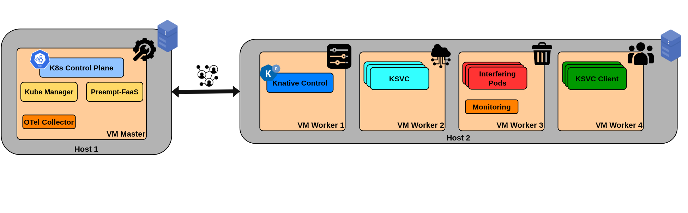

# vSwarm Benchmarks

This folder contains the benchmarks retrieved from the vSwarm suite, along with the [`invoker`](./invoker) tool employed as load generator.

## Prerequisites
- A Kubernetes cluster with PREEMPT-FaaS installed and configured
- The experiment volume provisioned and accessible (see [k8s-results-store](../k8s-results-store/))
- The `invoker` tool built and ready to be used (see [`invoker`](./invoker))
- The Knative patched version, which is able to interact with PREEMPT-FaaS managed resources; see https://github.com/dessertlab/knative-crd-scaled

## Purpose of the Tests

With these benchmarks we aim to evaluate the performance of our controller under **realistic serverless workloads**. The load generateor employed in these benchmarks allows us to retrieve **end-to-end metrics**, such as the **request latency** and the **throughput** achieved by the application. We also retireve **orchestration times** to evaluate the performance of the Kube-Manager and PREEMPT-FaaS controllers.

We want to evaluate the **impact of the improved orchestration times**, **under intense orchestration load**, granted by PREEMPT-FaaS **on end-to-end metrics**. In order to do so, we evaluate a specific scenario. We wait for the application to scale-to-zero. At this point, we start the load generator to trigger the **scale-up from zero instances**. These experiments will show how shorter orchestration times lead to better end-to-end performance, especially in terms of latency. For the **RNN benchmark** we also evaluate the **scale-up from 1 to 2 instances**.

## Experimental Setup



Our experimental setup consists of the following components.

- **Control Plane**: a single-node control plane hosting Kubernetes base components (e.g., Kube-apiserver, Kube-Manager, Kube-scheduler, etcd) and the PREEMPT-FaaS controller. This also node also hosts the [OpenTelemetry Collector](../../monitoring/open-telemetry-collector).
- **Worker Node 1**: hosts the patched Knative base components and, if the benchmark Knative services require it, a db instance.
- **Worker Node 2**: hosts the benchmark Knative services managed by .
- **Worker Node 3**: hosts the remaining [monitoring compoinents](../../monitoring/MONITORING.md) and the Pods scheduled by the interfering load generator (see [interfering-load](../interfering-load/README.md)).
- **Worker Node 4**: hosts the invokers that send requests to the benchmark Knative services in ** Worker Node 2**.

All nodes also run housekeeping Kubernetes services.

## Experiment workflow

In this section we provide the general setup of a vSwarm experiment workflow, understanding the role of each script and component.

**Note**: we deploy multiple instances of the benchmark Knative services, each with the respective invoker. This choice was mande for multiple reasons.

1. The invoker is a limited tool, which can only generate around a maxiumum of `50` RPS, which is not enough to stress multiple services.
2. Deploying a single service would lead to a situation where the service scale-up event might be served promtly only due to stocastic factors (e.g., the exact moment when the scaling is triggered is a point in time with low orchestration load). Multiple services allow us to limit the impact of said factors, madiating across the final results. All the deployed services are identical with the same priority level (when leveraging RTResoruces). **To reproduce our experimental evaluation, deploy `5` instances**.
3. If the services require a database, they share a single instance.

This folder stores a directory for each benchmark. We highlight the fact that these benchmarks have a common workflow, thus, any specific step required by a certan benchmark will be highlighted in the respective
README file. The general workflow is the following:

1. We enter the node hosting the benchmark Knative services (i.e., Worker Node 2) and pull all the required images. In Worker Node 1 we pull the db image, if required by the benchmark. This allows to never pull images when starting a new service replica, eliminating the pulling inconsistent delays from our experiments.
```yaml
imagePullPolicy: Never
```
2. If the service requires a database, we first deploy the manifest file that creates a db instance and a job to populate it. The database is unique and hosted on Worker Node 1.

3. The `setup-invoker-pods.sh` script creates `N` invoker Pods, equipped with the invoker tool and the `endpoints.json` file, required to send requests to the respective service. It also creates the services manifests, with and without the criticality level, depending on our choice to run the benchmark with RTResources or Deployments, respectively.

4. The `experiment.sh` performs the actual experiment.

5. We start each run by deploying the Knative services manifests. If we are testing the scale-up from zero, then we wait about a minute for the services to scale down.

6. We run the interfering load in background, continuously creating and deleting resources on the cluster to create orchestration load for the controllers. The interference type, RTResources or Deployments, matches the Knative service type. When leveraging RTResources, all services priorities are set to `1`, while all interfering resources are set to `2`. For further details on the interfering load, please refer to [interfering-load](../interfering-load/README.md).

7. We trigger all the invokers at the same time, scaling up all services, form 0 to 1 instance, or from 1 to 2 instances, depending on the experiment. Diffenrent scaling configurations are hard to trigger with the given benchmarks.

8. Once the benchmark is completed, we stop the interfering load.

9. We now retrieve orchestration times and end-to-end metrics from the monitoring infrastructure, and we store them in the experiment [results storage](../k8s-results-store/).

10. We delete the services.

11. `setup-invoker-pods.sh` can be employed to clean up the enviroment from all generated resources.

12. Users can use one of the pods in the [test-pods](../test-pods/) folder to access the experiment results and perform any additional analysis.
